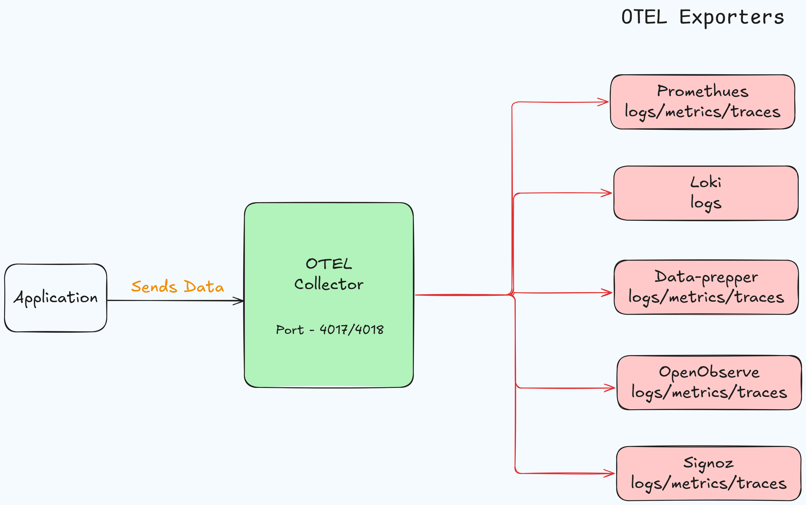

# OpenTelemetry Complete Guide: Overview and Installation
## Overview and Setup Guide

## Table of Contents
- [What is OpenTelemetry?](#what-is-opentelemetry)
- [Core Components](#core-components)
- [Data Types](#data-types)
- [Common Use Cases](#common-use-cases)
- [Key Benefits](#key-benefits)
- [Getting Started Steps](#getting-started-steps)
- [Architecture](#architecture-diagram)
- [Prerequisites](#prerequisites)
- [Installation](#installation)
- [Configuration](#configuration)
- [Service Setup](#service-setup)
- [Validation](#validation)
- [Troubleshooting](#troubleshooting)
- [Security Considerations](#security-considerations)
- [Maintenance](#maintenance)
- [Additional Resources](#additional-resources)

## What is OpenTelemetry?
OpenTelemetry (OTel) is an open-source observability framework that helps you understand what's happening in your applications. Think of it as a standardized way to collect and send monitoring data from your applications to any monitoring tool you choose.

## Core Components

### 1. Instrumentation
- **What**: Code that collects data from your applications
- **How**: Either automatic (zero code changes) or manual (adding specific code)
- **Where**: Added to your services and applications

### 2. Collector
- **Purpose**: Central hub for gathering and routing data
- **Function**: Receives, processes, and sends data to monitoring systems
- **Benefits**: Single point of configuration for all telemetry data

## Data Types

1. **Traces**
   - Shows the journey of a request through your system
   - Helps identify where time is spent and where errors occur

2. **Metrics**
   - Numbers that tell you how your system is performing
   - Example: CPU usage, response times, error rates

3. **Logs**
   - Text records of events in your system
   - Provides context and details about what happened

## Common Use Cases

1. **Monitoring Microservices**
   - Track requests across multiple services
   - Understand service dependencies

2. **Performance Monitoring**
   - Identify slow operations
   - Find bottlenecks

3. **Troubleshooting**
   - Debug issues faster
   - Understand error patterns

## Key Benefits

1. **Vendor Neutral**
   - Not locked into any specific monitoring tool
   - Can change tools without changing instrumentation

2. **Standardized**
   - Common format for all observability data
   - Consistent approach across different languages

3. **Future Proof**
   - Industry-standard approach
   - Broad community support

## Getting Started Steps

1. **Add Instrumentation**
   - Install OTel libraries in your application
   - Configure basic settings

2. **Set Up Collector**
   - Install the OTel Collector
   - Configure data sources and destinations

3. **Choose Monitoring Tool**
   - Connect to your preferred monitoring system
   - Start viewing your data

## Architecture Diagram


## Prerequisites
- Ubuntu Server 20.04 LTS or newer
- Sudo privileges
- Internet connection
- At least 1GB of RAM
- Minimum 2GB of free disk space

## Installation

### 1. Update System Packages
```bash
sudo apt-get update
sudo apt-get upgrade -y
```

### 2. Install Dependencies
```bash
sudo apt-get install -y curl systemd
```

### 3. Download OpenTelemetry Collector
```bash
curl -O https://github.com/open-telemetry/opentelemetry-collector-releases/releases/latest/download/otelcol_linux_amd64.deb
```

### 4. Install the Collector
```bash
sudo dpkg -i otelcol_linux_amd64.deb
```

## Configuration

### 1. Create Configuration Directory
```bash
sudo mkdir -p /etc/otel-collector
```

### 2. Create Basic Configuration File
Create a new file `/etc/otel-collector/config.yaml`:

[Refer to](./config.yaml)

## Service Setup

### 1. Create Systemd Service File
Create a new service file `/etc/systemd/system/otelcol.service`:

```ini
[Unit]
Description=OpenTelemetry Collector
After=network.target

[Service]
ExecStart=/usr/local/bin/otelcol-contrib --config /etc/otel-collector/config.yaml
Restart=always
User=root
Group=root

[Install]
WantedBy=multi-user.target
```

### 2. Start and Enable Service
```bash
sudo systemctl daemon-reload
sudo systemctl start otelcol
sudo systemctl enable otelcol
```

## Validation

### 1. Check Service Status
```bash
sudo systemctl status otelcol
```

### 2. Verify Ports are Listening
```bash
sudo netstat -tulpn | grep otelcol
```

### 3. Check Logs
```bash
sudo journalctl -u otelcol -f
```

## Troubleshooting

### Common Issues and Solutions

1. **Service Fails to Start**
   - Check logs: `sudo journalctl -u otelcol -n 50`
   - Verify config file syntax: `otelcol --config /etc/otel-collector/config.yaml --check`
   - Ensure correct permissions: `ls -l /etc/otel-collector/config.yaml`

2. **Connection Issues**
   - Verify ports are not blocked: `sudo ufw status`
   - Check if ports are in use: `sudo lsof -i :4317,4318`
   - Ensure correct network interfaces: `ip addr show`

3. **Memory Issues**
   - Check memory usage: `free -m`
   - Monitor resource usage: `top -u otel`

## Security Considerations

1. **Network Security**
   - Configure firewall rules to restrict access to collector ports
   - Use TLS for secure communication
   - Implement authentication when possible

2. **File Permissions**
   - Maintain strict file permissions on configuration files
   - Run collector as non-root user
   - Regularly audit system access

## Maintenance

### Regular Updates
```bash
# Check current version
otelcol --version

# Download and install latest version
curl -O https://github.com/open-telemetry/opentelemetry-collector-releases/releases/latest/download/otelcol_linux_amd64.deb
sudo dpkg -i otelcol_linux_amd64.deb
sudo systemctl restart otelcol
```

### Backup Configuration
```bash
# Create backup
sudo cp /etc/otel-collector/config.yaml /etc/otel-collector/config.yaml.backup

# Restore from backup if needed
sudo cp /etc/otel-collector/config.yaml.backup /etc/otel-collector/config.yaml
sudo systemctl restart otelcol
```
