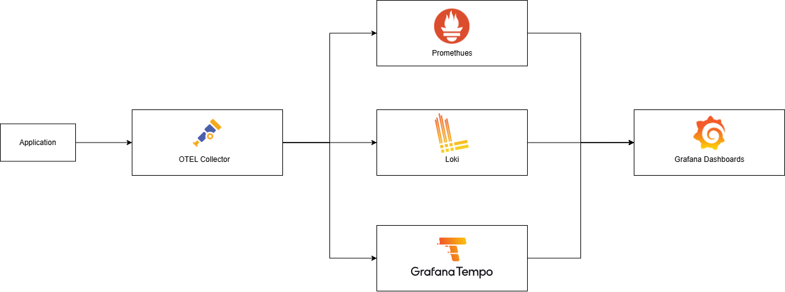
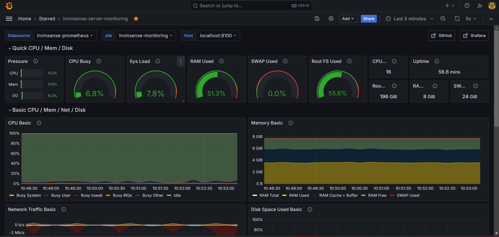
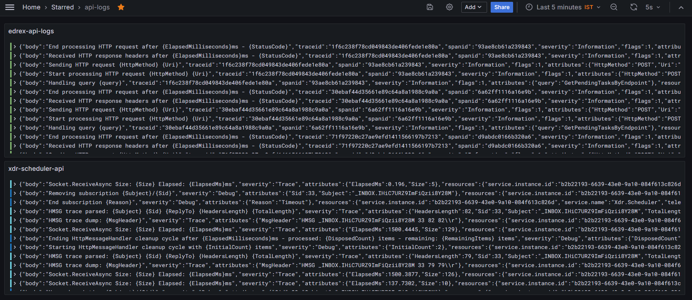
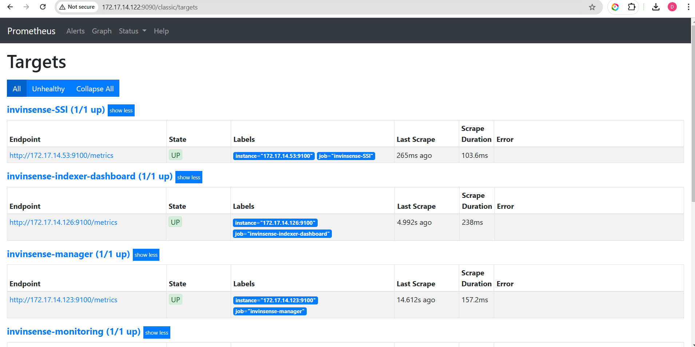

# Monitoring Stack Setup Guide
## Prometheus, Grafana, Loki with OpenTelemetry on Linux

## Table of Contents
- [Architecture Overview](#architecture-overview)
- [Component Descriptions](#component-descriptions)
- [Prerequisites](#prerequisites)
- [Installation Steps](#installation-steps)
  - [1. OpenTelemetry Collector](#1-opentelemetry-collector)
  - [2. Prometheus](#2-prometheus)
  - [3. Loki](#3-loki)
  - [4. Grafana](#4-grafana)
- [Configuration](#configuration)
- [Service Setup](#service-setup)
- [Integration](#integration-setup)
- [Validation](#validation)


## Architecture Overview

Same architecture working with these components:
1. **Application** → Generates telemetry data
2. **OpenTelemetry Collector** → Collects and processes telemetry data
3. **Prometheus** → Stores metrics
4. **Loki** → Stores logs
5. **Grafana** → Visualizes all data



## Component Descriptions

### OpenTelemetry Collector
- Acts as a central collector for all telemetry data
- Processes and routes data to appropriate backends
- Provides data transformation and filtering

### Prometheus
- Time-series database for metrics
- Handles metrics storage and querying
- Provides alerting capabilities
- Scrapes metrics from configured targets

### Loki
- Log aggregation system
- Stores and indexes log data
- Designed to be cost-effective and efficient
- Integrates seamlessly with Grafana

### Grafana
- Visualization platform
- Creates dashboards for metrics and logs
- Supports multiple data sources
- Provides alerting and notification features

## Prerequisites
- Ubuntu Server 20.04 LTS or newer
- Minimum 4GB RAM
- 20GB free disk space
- Root or sudo access
- systemd for service management

## Installation Steps

### 1. OpenTelemetry Collector

```bash
# Download and install OpenTelemetry Collector
curl -O https://github.com/open-telemetry/opentelemetry-collector-releases/releases/latest/download/otelcol_linux_amd64.deb
sudo dpkg -i otelcol_linux_amd64.deb

# Create configuration directory
sudo mkdir -p /etc/otel-collector
```

Create `/etc/otel-collector/config.yaml`:

For config reference
[Check this](./otel/config.yaml)


### 2. Prometheus

```bash
# Create Prometheus user
sudo useradd --no-create-home --shell /bin/false prometheus

# Create directories
sudo mkdir /etc/prometheus
sudo mkdir /var/lib/prometheus

# Download Prometheus
curl -LO https://github.com/prometheus/prometheus/releases/download/v2.45.0/prometheus-2.45.0.linux-amd64.tar.gz

# Extract and install
tar xvf prometheus-2.45.0.linux-amd64.tar.gz
sudo cp prometheus-2.45.0.linux-amd64/prometheus /usr/local/bin/
sudo cp prometheus-2.45.0.linux-amd64/promtool /usr/local/bin/

# Set ownership
sudo chown prometheus:prometheus /usr/local/bin/prometheus
sudo chown prometheus:prometheus /usr/local/bin/promtool
sudo chown -R prometheus:prometheus /etc/prometheus
sudo chown -R prometheus:prometheus /var/lib/prometheus
```

Create `/etc/prometheus/prometheus.yml`:
For config reference
[Check this](./promethues.yaml)


### 3. Loki

```bash
# Download and install Loki
curl -O -L "https://github.com/grafana/loki/releases/latest/download/loki-linux-amd64.zip"
unzip loki-linux-amd64.zip
sudo mv loki-linux-amd64 /usr/local/bin/loki

# Create Loki user
sudo useradd --system loki

# Create directories
sudo mkdir -p /etc/loki
sudo mkdir -p /var/lib/loki
```

Create `/etc/loki/config.yaml`:

For config reference
[Check this](./loki/loki-config.yaml)


### 4. Grafana

```bash
# Add Grafana repository
sudo apt-get install -y apt-transport-https software-properties-common
sudo wget -q -O /usr/share/keyrings/grafana.key https://apt.grafana.com/gpg.key

# Add repository
echo "deb [signed-by=/usr/share/keyrings/grafana.key] https://apt.grafana.com stable main" | sudo tee /etc/apt/sources.list.d/grafana.list

# Install Grafana
sudo apt-get update
sudo apt-get install grafana
```

## Service Setup

### 1. OpenTelemetry Collector Service

Create `/etc/systemd/system/otelcol.service`:
```ini
[Unit]
Description=OpenTelemetry Collector
After=network.target

[Service]
User=otel
ExecStart=/usr/bin/otelcol --config /etc/otel-collector/config.yaml
Restart=always

[Install]
WantedBy=multi-user.target
```

### 2. Prometheus Service

Create `/etc/systemd/system/prometheus.service`:
```ini
[Unit]
Description=Prometheus
After=network.target

[Service]
User=prometheus
ExecStart=/usr/local/bin/prometheus \
    --config.file /etc/prometheus/prometheus.yml \
    --storage.tsdb.path /var/lib/prometheus \
    --web.console.templates=/etc/prometheus/consoles \
    --web.console.libraries=/etc/prometheus/console_libraries
Restart=always

[Install]
WantedBy=multi-user.target
```

### 3. Loki Service

Create `/etc/systemd/system/loki.service`:
```ini
[Unit]
Description=Loki
After=network.target

[Service]
User=loki
ExecStart=/usr/local/bin/loki -config.file=/etc/loki/config.yaml
Restart=always

[Install]
WantedBy=multi-user.target
```

### Start All Services

```bash
# Reload systemd
sudo systemctl daemon-reload

# Start and enable services
sudo systemctl enable otelcol prometheus loki grafana-server
sudo systemctl start otelcol prometheus loki grafana-server
```

## Configuration

### Configure Grafana Data Sources

Access Grafana at `http://your-server:3000` (default credentials: admin/admin) and add:

1. **Prometheus**
   - Type: Prometheus
   - URL: http://localhost:9090

2. **Loki**
   - Type: Loki
   - URL: http://localhost:3100


## Integration Setup

### Metrics Flow
1. Application sends metrics via OpenTelemetry
2. Collector processes metrics
3. Prometheus stores metrics
4. Grafana visualizes metrics

### Logs Flow
1. Application sends logs via OpenTelemetry
2. Collector processes logs
3. Loki stores logs
4. Grafana visualizes logs

## Validation

1. **Check Services**
```bash
sudo systemctl status otelcol
sudo systemctl status prometheus
sudo systemctl status loki
sudo systemctl status grafana-server
```

2. **Verify Ports**
```bash
sudo netstat -tulpn | grep -E '3000|9090|3100|4317|4318|8889'
```

3. **Check Logs**
```bash
sudo journalctl -u otelcol -f
sudo journalctl -u prometheus -f
sudo journalctl -u loki -f
sudo journalctl -u grafana-server -f
```

## Screenshots
Grafana Server Monitoring


Loki Logs


Promethues Target

